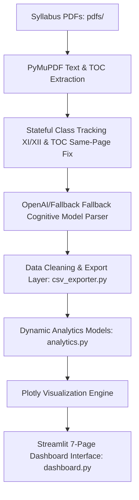

# 🎓 Curriculum Intelligence Analytics Platform

An advanced, research-grade educational analytics platform that processes CBSE school syllabi (Classes 9–12) and B.Tech engineering curricula to map, visualize, and analyze student learning pathways, skill development, and engineering readiness.

---

## 📖 Project Story & Objective

This platform answers five fundamental questions about educational curriculum evolution:
1. **What are students learning?** Map granular subject concepts across classes and levels.
2. **How does learning evolve?** Track the progression from qualitative secondary school knowledge to quantitative, derived engineering methodologies.
3. **Which skills become important over time?** Analyze the shift from quantitative and scientific reasoning to computational thinking, research skills, and design thinking.
4. **How does school prepare students for engineering?** Model transition paths and readiness alignment between high school concepts (e.g., algebra, mechanics) and university courses (e.g., engineering mathematics, data structures).
5. **How does curriculum complexity increase?** Measure and compare concepts count and difficulty scores across stages.

---

## 🏗️ System Architecture



---

## ✨ Key Features

* **Stateful Class Segmentation**: Automatically splits merged CBSE Senior Secondary PDFs (comprising Class 11 and Class 12) into respective chapters by tracking class headers sequentially.
* **Same-Page TOC Recovery**: Resolves outline parsing limitations when multiple chapters map to the same page, bringing out detailed curriculum indexes.
* **Dynamic Analytics Engine**: Automatically generates five research datasets:
  1. *Skill Evolution Dataset* (Stage, Skill Domain, Count)
  2. *Subject Complexity Dataset* (Stage, Subject, Concept Count, Difficulty Score)
  3. *Learning Path Dataset* (Source Concept to Target Concept transitions)
  4. *Educational Stage Dataset* (Stage summaries, average difficulty)
  5. *Engineering Readiness Dataset* (School to Engineering concept relationships)
* **OpenAI & Fallback Parsers**: Extracts core concepts, primary skill domains, summaries, and difficulty levels, with a deterministic local parser fallback.
* **Visual Presentation**: High-fidelity, interactive Plotly visualizations (Sankey, heatmaps, polar radars, treemaps) styled in a premium glassmorphic dark theme.

---

## 📂 Project Structure

```
├── pdfs/               # Input Syllabus PDFs (Class 9-12 & sem3-sem8)
├── src/
│   ├── main.py         # Pipeline entrypoint
│   ├── pdf_extractor.py # PDF Loading, metadata parsing, and OCR texts
│   ├── chapter_extractor.py # Chapter/section segmentations and TOC parsers
│   ├── curriculum_analyzer.py # OpenAI and rule-based analyzers
│   ├── csv_exporter.py # Dataset quality scoring, cleaning, and export
│   ├── analytics.py    # Analytics layer & required datasets generator
│   └── dashboard.py    # Streamlit multi-page visualization app
├── output/
│   └── curriculum_dataset.csv # Generated curriculum records
└── requirements.txt    # Python dependencies
```

---

## 🛠️ Setup & Execution

### 1. Installation
Ensure Python 3.10+ is installed, then set up the virtual environment:
```bash
python -m venv .venv
source .venv/bin/activate  # On Windows: .venv\Scripts\activate
pip install -r requirements.txt
```

### 2. Configure Environment
Create a `.env` file in the root directory:
```env
OPENAI_API_KEY=your-openai-api-key-here
OPENAI_MODEL=gpt-4o-mini
```
*Note: If no API key is provided, the platform automatically switches to its deterministic local semantic fallback engine.*

### 3. Run Pipeline & Dashboard
Extract data and generate the primary curriculum dataset:
```bash
python src/main.py
```
Start the interactive analytics platform:
```bash
streamlit run src/dashboard.py
```

---

## 📊 Dashboard Overview

The platform is structured into seven distinct interactive pages:
1. **Page 1: Executive Dashboard** - High-level KPIs (Total Subjects, Concepts, Skill Domains) and AI-generated summaries explaining stage dominance.
2. **Page 2: Learning Progression** - Multi-stage timeline displaying Concept Growth, Difficulty progression, and Subject growth.
3. **Page 3: Skill Intelligence** - Charts showing Skill Evolution stacked bars, Skill Intensity heatmaps, overall distribution, and Radar comparisons.
4. **Page 4: Subject Intelligence** - Subject Contribution to skill domains, Complexity scatter mapping, and density bars.
5. **Page 5: Concept Analytics** - Concept Treemaps (Subject → Concept hierarchy) and most frequent concepts.
6. **Page 6: Engineering Readiness** - Sankey flow maps from School to Engineering, overall Readiness gauges, and Transition Paths.
7. **Page 7: Curriculum Explorer** - Interactive database browser supporting filters by Stage, Class, Subject, Difficulty, Skill, and text search.
